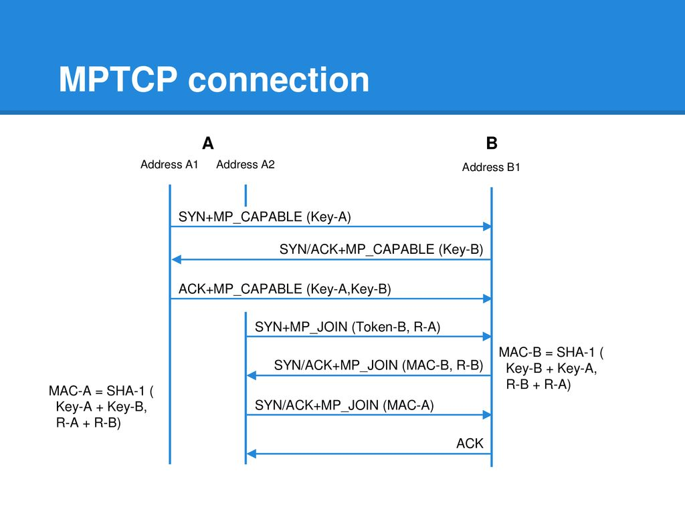
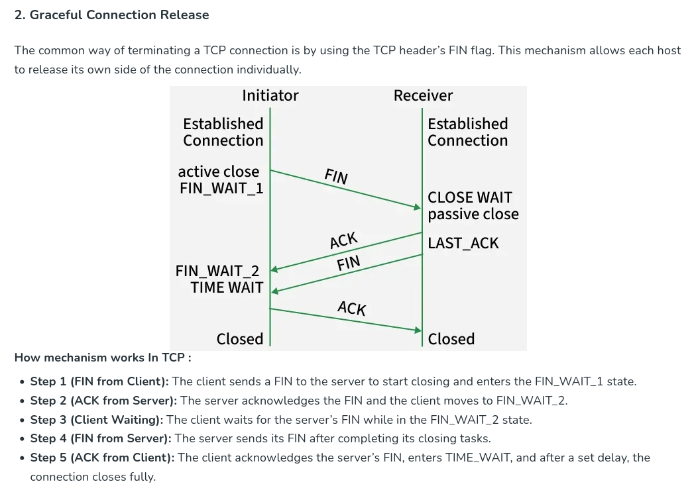
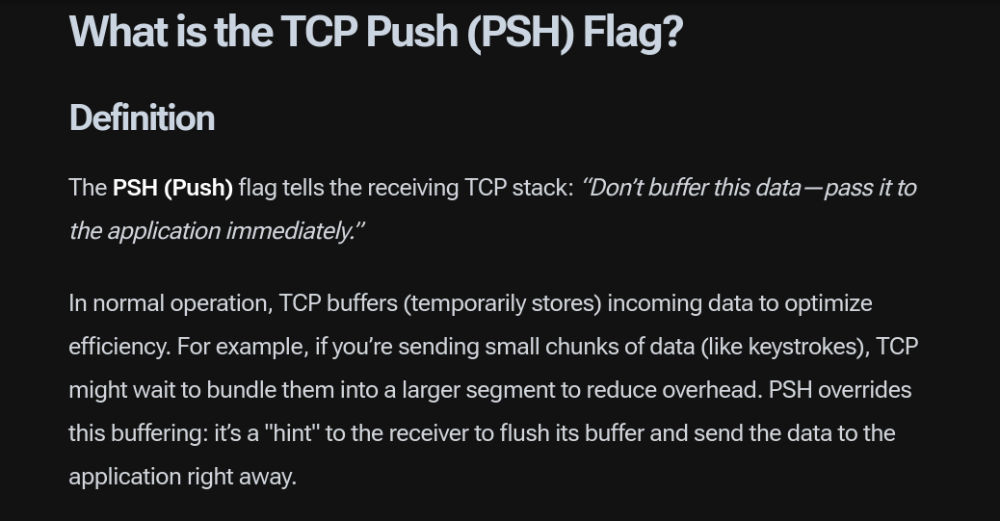

[ouverture de connexion mptcp](https://slideplayer.com/slide/13996085/86/images/18/MPTCP+connection+A+B+SYN%2BMP_CAPABLE+(Key-A)+SYN/ACK%2BMP_CAPABLE+(Key-B).jpg)

[fin de connexion tcp normale](https://www.geeksforgeeks.org/computer-networks/tcp-connection-termination/)

[flag push tcp](https://www.codegenes.net/blog/difference-between-push-and-urgent-flags-in-tcp/#what-is-the-tcp-push-psh-flag)

